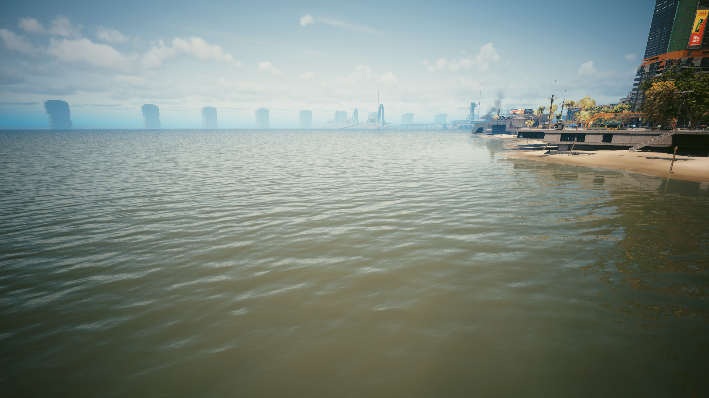
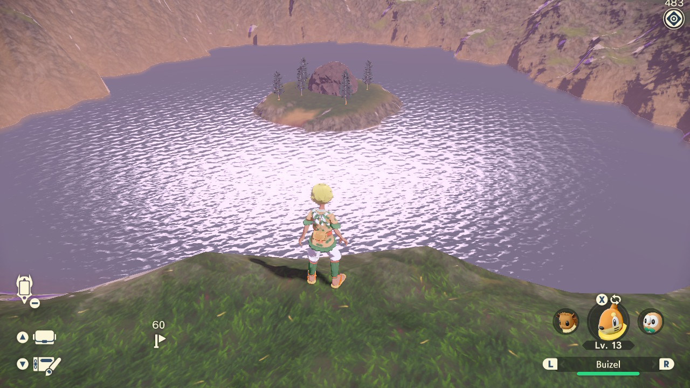
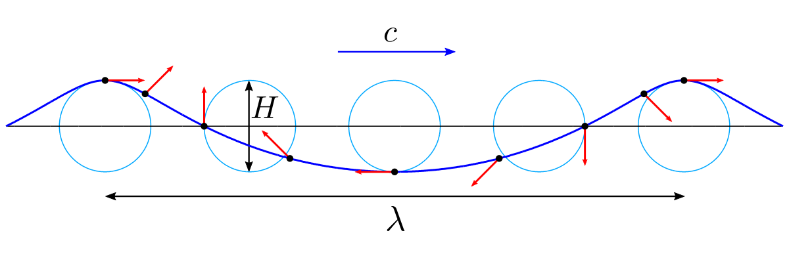
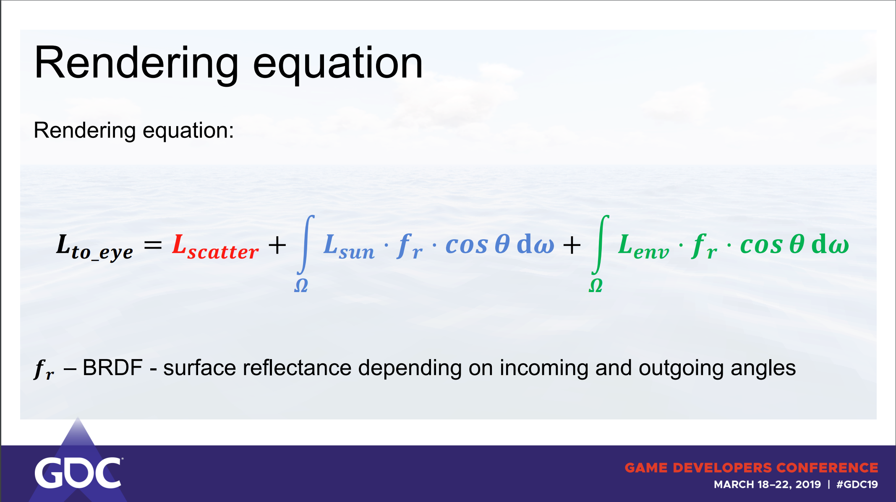
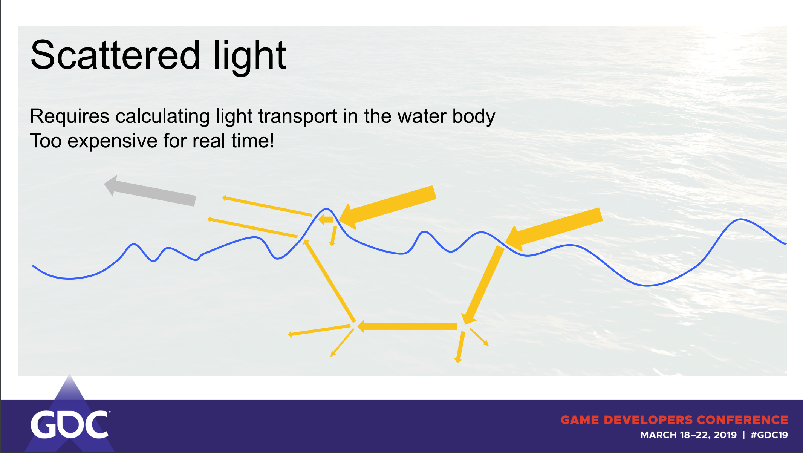
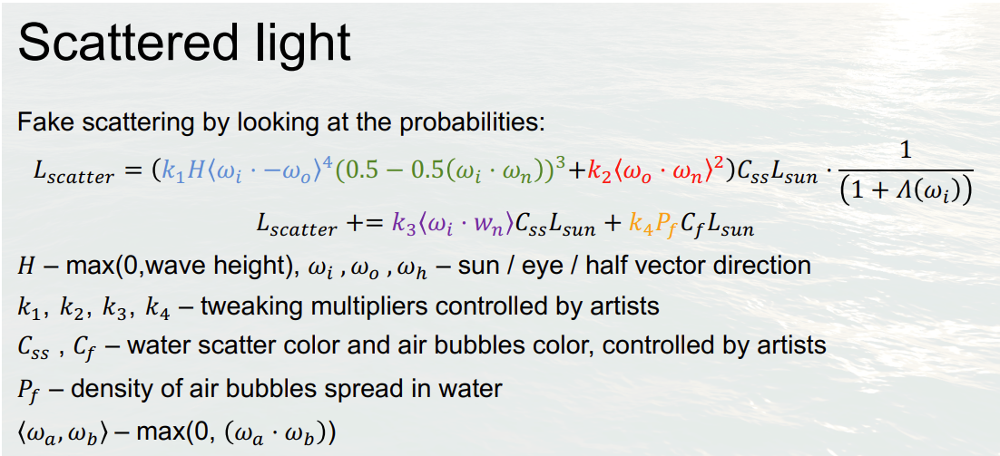

# **Rendering water in games**
---

In the fast-paced world of game development, technology keeps pushing boundaries every day. Developers strive to immerse players in experiences with cutting-edge technology - each generation, we see advances in graphics, AI, virtual and augmented reality, physics simulation, networking, and many more. Personally, I'm fascinated by the progress in computer graphics, especially in recent years. However, one aspect of this technological advancement has sparked my interest – water rendering and why in some recent games it is not as great as one would expect. 

Here are a few examples of recent games featuring water rendering:

 *Cyberpunk 2077 (Path-tracing on, highest graphical settings, DLSS3.0 on with 85% sharpness)*

 *[Pokemon Legends Arceus Water at a distance (by user rambucide, Imgur)](https://imgur.com/gallery/PXh2PNU)*

I would say the water in these examples is somewhat unconvincing and shallow.


# **Can we do better? Let's explore:**
---
There are different techniques when it comes to simulating water in games and graphic applications:

1. **Generating waves based on fluid dynamics**. Produces realistic-looking results with an actual displacement of the geometry requires a lot of computational power. Could benefit from using Fast Fourier Transforms (FFTs) to produce even more realistic-looking results, albeit implementing the FFT algorithm is quite complex.

2. **Texture displacement** - easy to implement and convincing up close but breaks the illusion with scaling.

3. **Fluid particle simulations** offer the most realistic-looking results, but are the most computationally expensive, as they need to simulate each particle in water. Furthermore, they are hard to implement and not suitable for most real-time games.


To avoid feeling overwhelmed by the options, let's explore one aspect of water rendering: ocean/sea simulation. Due to the vastness of oceans, texture displacement is not a suitable option because of scaling issues, and fluid particle simulation because of the performance overhead we will get with the simulation of millions of particles. This leaves us with the option of using fluid dynamics approximations to displace the geometry of the surface of water. 

Before diving deeper into how we can do this, let's find a good example of ocean simulation in games - "Sea of Thieves":

 
*["Sea of Thieves Has Some Gorgeous Water Shots" - IGN](https://www.youtube.com/watch?v=aGogFt4bhTM)*

This is what we will be striving towards.

From the [SIGGRAPH](https://www.youtube.com/watch?v=y9BOz2dFZzs&ab_channel=iamarugin) talk with technical artists from Rare, we can learn that Sea of Thieves uses FFT algorithm based on a [2001 paper form Jerry Tessendorf called "Simulating Ocean Water"](https://people.computing.clemson.edu/~jtessen/reports/papers_files/coursenotes2004.pdf). The paper suggests that the FFT algorithm is challenging to implement due to its mathematical complexity. Therefore for the sake of this blogpost, we will begin without implementing fast Fourier transforms. Essentially, FFT allows us to sample more waves for finer details of the water surface, therefore to understand the basics we will use simpler algorithms and possibly build on those as we proceed.

# **Simulating waves**
---

To render a water surface, let's consider it as a plane composed of many vertices. Therefore to visualize waves, we would need to displace the vertices of that plane according to some pattern. Nvidia in the first chapter of their book [GPU Gems](https://developer.nvidia.com/gpugems/gpugems/part-i-natural-effects/chapter-1-effective-water-simulation-physical-models), suggest one simple solution for rendering the surface of the water - the sum of sines. This approach calculates a scalar value with a set of sine waves as input, with which we can easily displace the surface points of a plane. One sine wave wouldn't create the desired effect, but if we calculate the sum of many sine waves with different parameters, we essentially get a white noise. 


If you recall from a math class, sine waves are oscillators making them relatively easy to describe with different parameters to alternate them. Let's look at a sine formula that we will be using:

$$f(xy,t) = \alpha * sin(xy * d * \omega + t * \phi)$$


As we can see the vertex shader (where we will calculate a displacement) only requires a few parameters: amplitude  \\((\alpha)\\), frequency \\((\omega)\\), phase \\((\phi)\\) and direction  \\((d)\\) of each wave we need to sample. Additionally, we need the total number of sampled sine waves per vertex and time to modulate the waves.


In my case, the wave parameters are generated procedurally on the CPU and then passed to the GPU. Based on how you generate the parameters the output will change significantly. This is an outline of the wave structure for the buffer to be sent to the GPU:


```glsl
struct Wave
{
    vec2 direction;
    float amplitude;
    float frequency;
    float phase;
};
```

In the vertex shader, we calculate the sum of sine waves based on the position of the vertex: 

```glsl
// Wave data that the shader expects as an input
Wave WavesData[numberOfWaves]; 

float SineWave(vec3 vertexPos, Wave w)
{
    // Get the position xz since we are working in 3D
    vec2 d = w.direction;
	float pos = vertexPos.x * d.x + vertexPos.z * d.y;  

    // Get the time and the phase
    float tphi = w.phase * input.time; 
    return w.aplitude * sin(pos * w.frequency + tphi);
}

// In the shader code running per vertex
// Calculate the sum of sines
float displacement = 0; 
for (int i = 0; i < numberOfWaves; i++)
{
    displacement += SineWave(input.vertexPos, WavesData[i]); 
}

```

The output of displacement is then added to the Y component of the vertex position. Now if we pass one wave this is the result:


However, this is far from ocean rendering, and if we add more waves, the amplitude will eventually add up and create unwanted effects. To reduce this effect we will need to add an additional algorithm to lower the amplitude and increase the wave frequency based on the wave number. This can be done beforehand while generating the waves and is as easy as just multiplying the amplitude and the wavelength with decreasing/increasing numbers:

```cpp
float frequency = 1.f;
float amplitude = 1.f; 
// User defined
const float waveFrequencyMult = 1.18f;
const float waveAmplitudeMult = 0.82f;

for (int i = 0; i < wavesCount; i++)
{
    wavesData[i] = GenerateNewWave();
    wavesData[i].frequency *= frequency;
    wavesData[i].amplitude *= amplitude;

    frequency *= waveFrequencyMult;
    amplitude *= waveAmplitudeMult;
}
```

Now, with many waves, the impact of each is reduced as they are added.

However, a sine wave can only displace vertices along the Y-axis of each surface point, whereas actual water has depth. Thankfully, the structure we've built can be easily adapted to calculate other wave types. But what wave can simulate the movement of the ocean water best?

Each surface point on a water surface moves in a circle, orbiting a fixed anchor point. As the crest of a wave approaches, the point moves towards it. After the crest passes, it slides back. The result is that water bunches up in crests and spreads out in troughs, and the same will happen to our vertices. This particular movement can be simulated with the Gerstner wave.

 *Gerstner wave*

To switch to the Gerstner wave, we need to change the function that calculates displacement (note that the function now gives an output in 2D):

$$P =  [\alpha * cosf,  \alpha * sinf]$$

```glsl
vec3 Gerstner(vec3 vertexPos, Wave w) 
{
	vec2 d = w.direction;
	float pos = vertexPos.x * d.x + vertexPos.z * d.y; 
	float tphi = w.phase * input.time;

	vec3 displacement = vec3(0);
	displacement.x = w.amplitude * d.x * cos(w.frequency * pos + tphi);
	displacement.y = w.amplitude * sin(w.frequency * pos + tphi);
	displacement.z = w.amplitude * d.y * cos(w.frequency * pos + tphi);
				
	return displacement;
}
```

With an input of 16 procedurally generated waves, this is the result: 


Now, for the best output, you can experiment with different wave parameters.

# **Tessellation**
---

Drawing a large number of triangles for the surface of the water comes at a computational cost, so let's optimize. When rendering a generated mesh (such as a plane or terrain with a height map), we can use tessellation to dynamically increase the level of detail closer to the camera. The implementation of this will be platform-dependent but I am leaving a few examples for the DX12 and OpenGL.

Essentially, tessellation involves dividing triangles (or patches) into smaller triangles, where the number of divisions performed on one triangle can be programmed. Personally, I  increase the number of divisions as the camera gets closer to the geometry:


[DirectX12 tessellation tutorial by The Demon Throne](https://thedemonthrone.ca/projects/rendering-terrain/rendering-terrain-part-8-adding-tessellation/)

[OpenGL tutorial by Victor Gordan](https://www.youtube.com/watch?v=21gfE-zUym8&ab_channel=VictorGordan)


# **Pixel shader**
--- 

Now that we have established the logic for displacing a vertex on a plane to create a somewhat believable ocean simulation, our next step is to shade it to resemble water.

But before we proceed to shade our water, let's calculate normals for our waves. We can easily achieve this by sampling the derivative of the Gerstner wave. Assuming the normals of our plane are XYZ(0,1,0):

```glsl
vec3 GerstnerNormal(vec3 vertexPos, Wave w) 
{
	vec2 d = normalize(w.direction);
	float pos =  vertexPos.x * d.x + vertexPos.z * d.y;
	float t = w.phase * srt_water->time;

	vec3 n = vec3(0.0f, 0.0f, 0.0f);
				
	float wa = w.frequency * w.amplitude;
	float s = sin(w.frequency * pos + t);
	float c = cos(w.frequency * pos + t);

	n.x = -d.x * wa * c;
	n.z = -d.y * wa * c;
	n.y = wa * s;

	return n;
}
```
This code snipped is adapted from [this](https://github.com/GarrettGunnell/Water/blob/1673a12e796c5745aea6fa26eda53261da8efa80/Assets/Shaders/Water.shader#L140) water simulation project by YouTuber Acerola.

During the SIGGRAPH talk, the developers of Sea of Thieves only mentioned that they didn't use physically based (PBR) shading for rendering their water but didn't give any further details. Therefore, we will turn to another source for shading our water - a GDC talk - ["Wakes, Explosions and Lighting: Interactive Water Simulation in Atlas"](https://www.youtube.com/watch?v=Dqld965-Vv0&ab) from the developers of Atlas. This presentation provides detailed insights into ocean simulation and rendering. 

We are particularly interested in their approach to lighting and their rendering equation: 



After taking a closer look, we can observe that it resembles the basic PBR equation but includes environment reflections and light scattering. For us, the most interesting of the three components is the first one \\((Lscatter)\\) - a subsurface scattering calculation. As the name suggests this component calculates how much light scatters inside of a body after penetrating it. This effect can be seen when you shine a light through your fingers. 




Without this effect, our water will look unnatural, like plastic or metal. Although delving into the mathematical and statistical aspects of this equation may be challenging, we can still break down what each component calculates.



- The first term (k1) calculates the quantity of scattering occurrences based on the wave height.
- The second term (k2) calculates the strength of the reflected light towards the eye.
- The third term (k3) is Lambert's cosine law.
- The last term (k4) is an ambient light value.

Each term is then multipled with a scatter color \\((Css)\\) the sun irradiance color \\((Lsun)\\) and ambient color \\((Cf)\\) defined by artists.

For more detailed formulas on specular and environmental reflection, refer to the original talk or the [pdf](https://gpuopen.com/gdc-presentations/2019/gdc-2019-agtd6-interactive-water-simulation-in-atlas.pdf) of the presentation. 

After implementing environment reflection, you will have a cube map texture for the reflections. This is an ideal time to add a skybox and an actual sun display on it. A detailed Kelvin van Hoorn tutorial on how to achieve this can be found [here](https://kelvinvanhoorn.com/2022/03/17/skybox-tutorial-part-1/). And just like that, our water starts to look more realistic than ever:


However, there are still several aspects we could improve on:

1. Adding foam.
2. Implementing FFTs.
3. Adding a distance fog.
4. Implementing a day/night cycle (from the tutorial of [Kelvin van Hoorn](https://kelvinvanhoorn.com/2022/03/17/skybox-tutorial-part-1/))
5. Implementing a system for the ocean to follow the player.
6. Adding objects (boats) floating on the surface of the ocean.


In conclusion, we can see why, the examples of water rendering at the beginning of this blog post are not impressive for the players. Water simulations are computationally expensive and quite complex to implement.
It's clear why only games with a specific focus on water invest the resources to create more detailed and visually impressive water simulations.

However, water simulation can be an intriguing and rewarding topic for graphics programmers and tech artists to explore, as it requires an integration of complex techniques into a cohesive system. As computational power continues to grow, we can expect even more impressive advancements in water rendering.

I hope this tutorial/article has been helpful to someone interested in this field. I've compiled a list of resources that I found valuable during my research:

- [Rendering water in Unity by Acerola](https://github.com/GarrettGunnell/Water) (especially helpful - YouTube videos with great explanations and this project, together with this blog post, was inspired by his video) 
- [The Technical Art of Sea of Thieves](https://www.youtube.com/watch?v=y9BOz2dFZzs&ab_channel=iamarugin)
- [GPU Gems Effective Water Simulation from Physical Models](https://developer.nvidia.com/gpugems/gpugems/part-i-natural-effects/chapter-1-effective-water-simulation-physical-models)
- [Simulating Ocean Water by Jerry Tessendorf](https://people.computing.clemson.edu/~jtessen/reports/papers_files/coursenotes2004.pdf)
- [How water works in Sea of Thieves by Stylized Station](https://www.youtube.com/watch?v=EMb_FUmr0Ts&ab_channel=StylizedStation)
- [GDC talk - "Wakes, Explosions and Lighting: Interactive Water Simulation in Atlas"](https://gpuopen.com/gdc-presentations/2019/gdc-2019-agtd6-interactive-water-simulation-in-atlas.pdf)
- [DirectX12 tessellation tutorial by The Demon Throne](https://thedemonthrone.ca/projects/rendering-terrain/rendering-terrain-part-8-adding-tessellation/)
- [OpenGL tutorial by Victor Gordan](https://www.youtube.com/watch?v=21gfE-zUym8&ab_channel=VictorGordan)
- [Skybox tutorial by Kelvin van Hoorn](https://kelvinvanhoorn.com/2022/03/17/skybox-tutorial-part-1/)
- [Unity at GDC](https://www.youtube.com/watch?v=wwqrq2q6_LM&ab_channel=Unity)


This project is a part of my learning experience as a second-year student at Breda University of Applied Sciences. 

<div class="crop">
   
</div>

